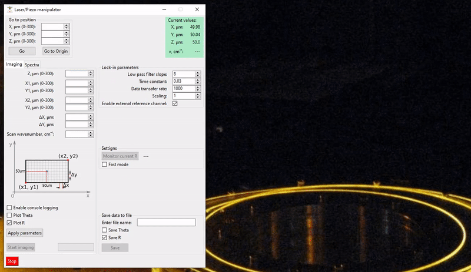

# IR-PHI GUI

    

A simple GUI application that controls the infrared photothermal heterodyne imaging (IR-PHI) system. 

More information about the IR-PHI [technique](https://aip.scitation.org/doi/abs/10.1063/1.5142277), [applications](https://pubs.acs.org/doi/abs/10.1021/acs.est.1c05181), and [image restoration](https://pubs.aip.org/aip/jcp/article-abstract/155/21/214202/199981/Deep-image-restoration-for-infrared-photothermal?redirectedFrom=fulltext) can be found on the [web](https://scholar.google.com/scholar?hl=en&as_sdt=0%2C5&q=ir-phi&btnG=).

## Features
- **Imaging**: Capture infrared photothermal heterodyne imaging across a predetermined area with real-time monitoring.
- **Spectroscopy**: Perform spectroscopy at specific points, with real-time monitoring of the process.

These features are achieved through the control of the following components:
- **Mad City Labs Piezo Micropositioning Stage**: Precise control over sample positioning for imaging and spectroscopy.
- **M Squared Laser**: Control the wavelength of the laser for accurate and adjustable imaging conditions.
- **Lock-in Amplifier**: Real-time signal readout and analysis for both imaging and spectroscopy applications.

## Dependencies

Before running the GUI, make sure to install the required Python packages from *requirements.txt*.

### Python Version:
This software has been tested with *Python 3.8*.

### Required Drivers and Software:

**Install the following drivers from the official sources:**
- Piezo Stage (Mad Piezo drivers and Nano Drive software).
- Lock-in Amplifier (Zurich Instruments LabOne software).
- NI VISA for the functionality of the pyvisa package, which is required for communicating with the lock-in amplifier.

**Following has to be configured manually:**
- Lasers (M Squared). You will need to [configure](https://pureinfotech.com/set-static-ip-address-windows-10/) a static IP address for the laser control system.
- Mirror Correction Motor (Newport TRA6CC and CONEX-CC). To use these units you need to install [.NET Framework 4.8](https://dotnet.microsoft.com/en-us/download/dotnet-framework/net48).

***Important Notes for .NET Integration:***

- Do not install `clr` or `pythonnet` from pip.

- Install the appropriate pythonnet version manually using a precompiled wheel from this repo.

## Running
To launch the GUI, use one of the following files:

- `Main.py` (runs with a console)
- `Main.pyw` (runs without a console)

## Examples

### Imaging

### Spectroscopy

